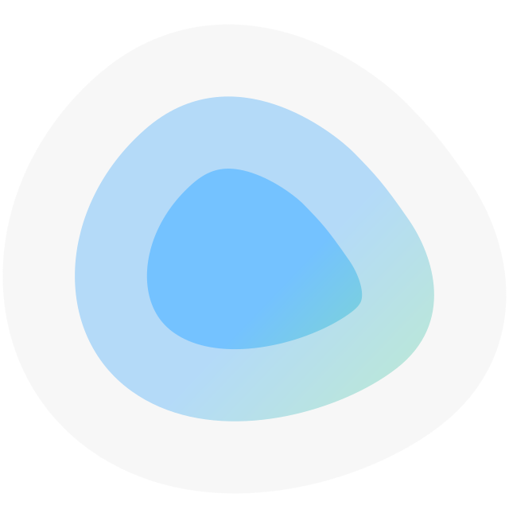

<div align="center" width="100%">
    
</div>

# Dockge

A fancy, easy-to-use and reactive self-hosted docker compose stack-oriented manager forked from louislam/dockge that has had several Pull Requests merged.

[](https://github.com/cmcooper1980/dockge) [](https://hub.docker.com/r/cmcooper1980/dockge/tags) [](https://hub.docker.com/r/cmcooper1980/dockge/tags) [](https://github.com/cmcooper1980/dockge/commits/master/)


View Video: https://youtu.be/AWAlOQeNpgU?t=48

## ⭐ Features

- 🧑‍💼 Manage your `compose.yaml` files
  - Create/Edit/Start/Stop/Restart/Delete
  - Update Docker Images
- ⌨️ Interactive Editor for `compose.yaml`
- 🦦 Interactive Web Terminal
- 🕷️ (1.4.0 🆕) Multiple agents support - You can manage multiple stacks from different Docker hosts in one single interface
- 🏪 Convert `docker run ...` commands into `compose.yaml`
- 📙 File based structure - Dockge won't kidnap your compose files, they are stored on your drive as usual. You can interact with them using normal `docker compose` commands


- 🚄 Reactive - Everything is just responsive. Progress (Pull/Up/Down) and terminal output are in real-time
- 🐣 Easy-to-use & fancy UI - If you love Uptime Kuma's UI/UX, you will love this one too


## ⭐ Pull Requests Merged:
- PR # 83: Allow specifying which user the stack files should belong to (by: https://github.com/RichyHBM)
- PR #414: Set/Update Friendly Name (by https://github.com/lohrbini)
- PR #438: Docker Compose Pull Skip Local Images (by https://github.com/vladaurosh)
- PR #575: Theme Options Enabled in Settings (by https://github.com/CampaniaGuy)
- PR #576: Add an Update All Button (by https://github.com/DomiiBunn)
- PR #593: Group stacks by its agent (by https://github.com/ESPGranEdu)
- PR #623: Added Support for Pasting Text in the Terminal (by https://github.com/lukasondrejka)
- PR #634: Build Frontend During Docker Build (by https://github.com/Jamie-)
- PR #637: Implement RIGHT and LEFT KEYS terminal navigation (by https://github.com/lukasondrejka)
- PR #642: Remove Useless Scrollbar (by https://github.com/cyril59310)
- PR #649: Add Container Control Buttons (by https://github.com/mizady)
- PR #685: Preserve YAML Comments (by https://github.com/turnah)
- PR #700: Add Resource Usage Stats (by https://github.com/justwiebe)
- PR #714: Conditional stack files deletion (by: https://github.com/husa)


## 🔧 How to Install

Requirements:
- [Docker](https://docs.docker.com/engine/install/) 20+ / Podman
- (Podman only) podman-docker (Debian: `apt install podman-docker`)
- OS:
  - Major Linux distros that can run Docker/Podman such as:
     - ✅ Ubuntu
     - ✅ Debian (Bullseye or newer)
     - ✅ Raspbian (Bullseye or newer)
     - ✅ CentOS
     - ✅ Fedora
     - ✅ ArchLinux
  - ❌ Debian/Raspbian Buster or lower is not supported
  - ❌ Windows (Will be supported later)
- Arch: armv7, arm64, amd64 (a.k.a x86_64)

### Basic

- Default Stacks Directory: `/opt/stacks`
- Default Port: 5001

```
# Create directories that store your stacks and stores Dockge's stack
mkdir -p /opt/stacks /opt/dockge
cd /opt/dockge

# Download the compose.yaml
curl https://raw.githubusercontent.com/cmcooper1980/dockge/master/compose.yaml --output compose.yaml

# Start the server
docker compose up -d

# If you are using docker-compose V1 or Podman
# docker-compose up -d
```

Dockge is now running on http://localhost:5001

### Advanced

If you want to store your stacks in another directory, you can generate your compose.yaml file by using the following URL with custom query strings and change the image from `louislam/dockge:1` to `cmcooper1980/dockge` after downloading if you want to use this fork; or see and update the example docker-compose.yml file at the bottom of this page.

# Download your compose.yaml (in the link, change 5001 to your custom port and the /opt/stacks portion to your custom stack location)
curl "https://dockge.kuma.pet/compose.yaml?port=5001&stacksPath=/opt/stacks" --output compose.yaml
```

- port=`5001`
- stacksPath=`/opt/stacks`

Interactive compose.yaml generator is available on: 
https://dockge.kuma.pet

## How to Update

```bash
cd /opt/dockge
docker compose pull && docker compose up -d
```

## Screenshots


## Others

Dockge is built on top of [Compose V2](https://docs.docker.com/compose/migrate/). `compose.yaml`  also known as `docker-compose.yml`.

`compose.yaml` file above is great if cloning and building locally, otherwise, you can use this `docker-compose.yml` file to run docker command:
`docker compose up -d` just edit the approprite field, `[CONFIG_LOCATION_FOR_DOCKGE]` (difference from compose.yaml is it does not have the build parameter):
```
services:
  dockge:
    image: cmcooper1980/dockge:latest
    container_name: dockge
    restart: unless-stopped
    environment:
      # Tell Dockge where is your stacks directory
      DOCKGE_STACKS_DIR: /opt/stacks #must be the same as the source and target bind mounted volume
      # Both PUID and PGID must be set for it to do anything
      - PUID=1000 # Set the stack file/dir ownership to this user
      - PGID=1000 # Set the stack file/dir ownership to this group
    ports:
      # Host Port : Container Port
      - 5001:5001
    volumes:
      - type: bind
        source: /var/run/docker.sock
        target: /var/run/docker.sock
        bind:
          create_host_path: true
      - type: bind
        source: [CONFIG_LOCATION_FOR_DOCKGE] # or wherever you keep your app data
        target: /app/data
        bind:
          create_host_path: true
      # If you want to use private registries, you need to share the auth file with Dockge:
      # - /root/.docker/:/root/.docker

      # Stacks Directory
      # ⚠️ READ IT CAREFULLY. If you did it wrong, your data could end up writing into a WRONG PATH.
      # ⚠️ 1. FULL path only. No relative path (MUST)
      # ⚠️ 2. source: and target: can be your preference but have to match, the environment variable
      #      DOCKGE_STACKS_DIR also has to match and is what tells dockge where your stacks
      #      directory is in the container
      - type: bind
        source: /opt/stacks
        target: /opt/stacks
        bind:
          create_host_path: true
